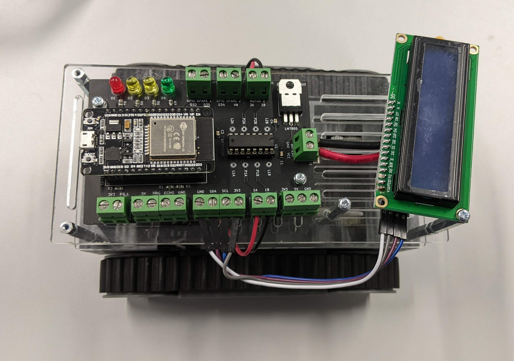
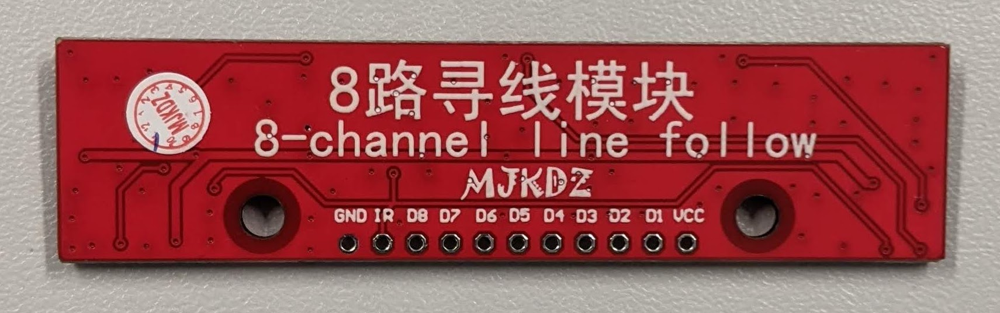
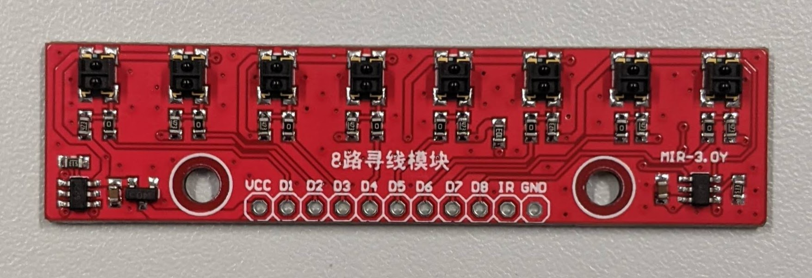

# Robotwagentje

Bavo Debraekeleer 
Docent: Marc Smets 

Smart Systems, Major Internet of Things, Elektronica-ICT 
AP Hogeschool 
Academiejaar 2021-2022

<a href="https://bavodebraekeleer.github.io/bavod-robotwagentje-analyse/#/">Robotwagentje Analyse GitHub Pages</a> 
<a href="https://ap-it-gh.github.io/ssys-cursus/#/deliverables/analyse">Smart Systems GitHub Pages</a> 

---

# Probleemstelling

Ontwerp van een schakelingen om een robotwagentje aan te sturen.
Dit opgedeeld in twee deel schakelingen.
Een hoofd PCB met een ESP32, als ook een dochter PCB met een ATMega en sensoren om de sturing te kunnen realiseren.
De vereisten zijn omschreven in de To-Be Situatie.

---

## As-Is Situatie

 - Voltage Regulator LM7805 through hole
 - Motord river SN754410 through hole + 2x 2 motor pins: 1A, 1B, 2A, 2B
 - 4x LED's: 1x rood, 2x geel, 1x groen
 - LCD scherm module, I²C pins op PCB: GND, SDA, SCL, 3V3
 - Ultrasoon module aansluiting: 5V, TRIG, ECHO, GND
 - 3 voeding pins: 3V3, 5V, GND
 - 2 pin aansluiting: 3V3, PQ_L
 - 2x 2 GPIO spare pins

---

## To-Be Situatie

### Opdracht doelen

 - Sensoren toepassen in een praktische schakeling.
 - Voldoende materiaal genereren voor gebruik in het eerste jaar.
 - Besturing voorzien.

### Sturingschakeling vereisten:

Dit is de hoofd PCB.

 - 2x UART connectoren
 - 3x I²C connectoren
 - Voltage regulator LDL1117 SMD
	- 5V
	- 3.3V
 - Polariteitsbeveiliging
 - 2x SMD Motor driver, vb. LA6583MC-AH
	- 7.2V 700mA
	- Prijs < €1
	- Start stroom = 6x nominale stroom
	- Diode in tegen polariteit. Misschien reeds aanwezig op IC. Best altijd extra diode bij plaatsen voor de zekerheid.
 - OLED-scherm met I²C-sturing op PCB
 - ESP32 WROOM DevKit module, zie Schematic Checklist in Hardware Design Guidelines
 - Mounting drill holes, voor bevestiging op wagentje
 - Batterij aansluiting (GND, VCC)

### Sensorschakeling vereisten:

Op dochter PCB bordje.

 - ATMega328p/Arduino Nano SMD
 - Ultrasoon + IR afstandssensoren
 - 8 channel IR Linetracker
 

### Besturing

 - Manuele bediening mogelijkheid.
 - Automatisch rijden.
 - Volgens vast patroon rijden.

Er moeten ook een aantal verkeer signalisaties ontwikkeld worden zoals verkeerslichten, slagbomen, enz. 
Deze moeten dienen om de software van het wagentje te kunnen testen.

---

## Mindmap

<iframe width="100%" height="500px" src="https://miro.com/app/live-embed/uXjVOER2lsE=/?moveToViewport=-498,-442,1048,920" frameBorder="0" scrolling="no" allowFullScreen></iframe>

---

# Hardware Analyse

## Blokschema

---

## Specificaties

### Microcontroller

<table style="width: 100%">
<colgroup>
    <col span="1" style="width: 15%;">
    <col span="2" style="width: 70%;">
	<col span="3" style="width: 25%;">
</colgroup>
<tr>
    <th>Naam</th>
    <th>Eigenschappen</th>
    <th>Data</th>
</tr>
<tr>
    <td>ESP32-WROOM-32</td>
    <td>
        <ul>
            <li><b>ESP32 WROOM DevKit module</b></li>
			<li>Core: ESP32-D0WD</li>
			<li>SPI flash: 4 MB, 32 Mbits, 3.3V</li>
			<li>Crustal: 40 MHz</li>
            <li>Vcc = 3.0V - 3.6V</li>
            <li>Ioperating = 80mA</li>
			<li>Imin delivered by power supply = 500mA</li>
			<li>Module interfaces: SD card, UART, SPI, SDIO, I2C, LED PWM, Motor PWM, I2S, IR, pulse counter, GPIO, capacitive touch sensor, ADC, DAC, TWAI.</li>
			<li>On-chip sensor: Hall sensor</li>
			<li>Operating temperature: -40°C ~ +85°C</li>
			<li><i>Eenheidsprijs: €3,82</i></li>
			<li><i>Lead time: 10 weken</i></li>
        </ul>
    </td>
    <td>
		<a href="./datasheets/esp32_wroom_32d_esp32_wroom_32u_datasheet_en-1365844.pdf">Datasheet Module</a> 
		<a href="./datasheets/esp32_datasheet_en.pdf">Datasheet ESP32</a> 
		<a href="./datasheets/esp32_hardware_design_guidelines_en.pdf">Hardware Design Guidelines</a> 
		<a href="https://www.mouser.be/ProductDetail/Espressif-Systems/ESP32-WROOM-32U-H4?qs=Li%252BoUPsLEnumDLBsCjw4aA%3D%3D">Winkel</a> 
	</td>
</tr>
<tr>
    <td>Arduino Nano</td>
    <td>
        <ul>
            <li><b>ESP32 WROOM DevKit module</b></li>
			<li>Core: ESP32-D0WD</li>
			<li>SPI flash: 4 MB, 32 Mbits, 3.3V</li>
			<li>Crustal: 40 MHz</li>
            <li>Vcc = 3.0V - 3.6V</li>
            <li>Ioperating = 80mA</li>
			<li>Imin delivered by power supply = 500mA</li>
			<li>Module interfaces: SD card, UART, SPI, SDIO, I2C, LED PWM, Motor PWM, I2S, IR, pulse counter, GPIO, capacitive touch sensor, ADC, DAC, TWAI.</li>
			<li>On-chip sensor: Hall sensor</li>
			<li>Operating temperature: -40°C ~ +85°C</li>
			<li><i>Eenheidsprijs: €3,82</i></li>
			<li><i>Lead time: 10 weken</i></li>
        </ul>
    </td>
    <td>
		<a href="./datasheets/esp32_wroom_32d_esp32_wroom_32u_datasheet_en-1365844.pdf">Datasheet Module</a> 
		<a href="./datasheets/esp32_datasheet_en.pdf">Datasheet ESP32</a> 
		<a href="./datasheets/esp32_hardware_design_guidelines_en.pdf">Hardware Design Guidelines</a> 
		<a href="https://www.mouser.be/ProductDetail/Espressif-Systems/ESP32-WROOM-32U-H4?qs=Li%252BoUPsLEnumDLBsCjw4aA%3D%3D">Winkel</a> 
	</td>
</tr>
</table>

---

### Sturing

<table style="width: 100%">
<colgroup>
    <col span="1" style="width: 15%;">
    <col span="2" style="width: 30%;">
    <col span="3" style="width: 40%;">
	<col span="4" style="width: 25%;">
</colgroup>
<tr>
    <th>Naam</th>
    <th>Eigenschappen</th>
    <th>Argumentatie</th>
    <th>Data</th>
</tr>
<tr>
    <td>LA6583MC-AH</td>
    <td>
        <ul>
            <li><b>Motor driver</b></li>
            <li>Vcc = V - V</li>
            <li>Imax = mA</li>
			<li><i>Eenheidsprijs vanaf 10 stuks: €</i></li>
			<li><i>Lead time: </i></li>
        </ul>
    </td>
    <td>
		Argumentatie.
	</td>
    <td>
		<a href="./datasheet/">Datasheet</a> 
		<a href="url">Winkel</a> 
	</td>
</tr>
<tr>
    <td>Naam</td>
    <td>
        <ul>
            <li><b>OLED-scherm</b></li>
            <li>Vcc = V - V</li>
            <li>Imax = mA</li>
			<li><i>Eenheidsprijs vanaf 10 stuks: €</i></li>
			<li><i>Lead time: </i></li>
        </ul>
    </td>
    <td>
		Argumentatie.
	</td>
    <td>
		<a href="./datasheet/">Datasheet</a> 
		<a href="url">Winkel</a> 
	</td>
</tr>
<tr>
    <td>8line</td>
    <td>
        <ul>
            <li><b>ATMega verbindingsbordje.</b></li>
            <li>Vcc = V - V</li>
            <li>Imax = mA</li>
			<li><i>Eenheidsprijs vanaf 10 stuks: €</i></li>
			<li><i>Lead time: </i></li>
        </ul>
    </td>
    <td>
		Argumentatie.
	</td>
    <td>
		<a href="./datasheet/">Datasheet</a> 
		<a href="url">Winkel</a> 
	</td>
</tr>
</table>

---

### Voeding

<table style="width: 100%">
<colgroup>
    <col span="1" style="width: 15%;">
    <col span="2" style="width: 30%;">
    <col span="3" style="width: 40%;">
	<col span="4" style="width: 25%;">
</colgroup>
<tr>
    <th>Naam</th>
    <th>Eigenschappen</th>
    <th>Argumentatie</th>
    <th>Data</th>
</tr>
<tr>
    <td>Naam</td>
    <td>
        <ul>
            <li><b>Batterij</b></li>
            <li>Vcc = V - V</li>
            <li>Imax = mA</li>
			<li><i>Eenheidsprijs vanaf 10 stuks: €</i></li>
			<li><i>Lead time: </i></li>
        </ul>
    </td>
    <td>
		Argumentatie.
	</td>
    <td>
		<a href="./datasheet/">Datasheet</a> 
		<a href="url">Winkel</a> 
	</td>
</tr>
<tr>
    <td>LDL1117 5V</td>
    <td>
        <ul>
            <li><b>SMD Voltage Regulator</b></li>
            <li>Vcc = V - V</li>
            <li>Imax = mA</li>
			<li><i>Eenheidsprijs vanaf 10 stuks: €</i></li>
			<li><i>Lead time: </i></li>
        </ul>
    </td>
    <td>
		Argumentatie.
	</td>
    <td>
		<a href="./datasheet/">Datasheet</a> 
		<a href="url">Winkel</a> 
	</td>
</tr>
<tr>
    <td>LDL1117 3.3V</td>
    <td>
        <ul>
            <li><b>SMD Voltage Regulator</b></li>
            <li>Vcc = V - V</li>
            <li>Imax = mA</li>
			<li><i>Eenheidsprijs vanaf 10 stuks: €</i></li>
			<li><i>Lead time: </i></li>
        </ul>
    </td>
    <td>
		Argumentatie.
	</td>
    <td>
		<a href="./datasheet/">Datasheet</a> 
		<a href="url">Winkel</a> 
	</td>
</tr>
<tr>
    <td>Naam</td>
    <td>
        <ul>
            <li><b>Polariteitsbeveiliging</b></li>
            <li>Vcc = V - V</li>
            <li>Imax = mA</li>
			<li><i>Eenheidsprijs vanaf 10 stuks: €</i></li>
			<li><i>Lead time: </i></li>
        </ul>
    </td>
    <td>
		Argumentatie.
	</td>
    <td>
		<a href="./datasheet/">Datasheet</a> 
		<a href="url">Winkel</a> 
	</td>
</tr>
</table>

---

### Sensoren

<table style="width: 100%">
<colgroup>
    <col span="1" style="width: 15%;">
    <col span="2" style="width: 30%;">
    <col span="3" style="width: 40%;">
	<col span="4" style="width: 25%;">
</colgroup>
<tr>
    <th>Naam</th>
    <th>Eigenschappen</th>
    <th>Argumentatie</th>
    <th>Data</th>
</tr>
<tr>
    <td>MIR-3.0Y</td>
    <td>
        <ul>
            <li><b>8x IR Line Tracking Module</b></li>
            <li>Vcc = V - V</li>
            <li>Imax = mA</li>
			<li><i>Eenheidsprijs vanaf 10 stuks: €</i></li>
			<li><i>Lead time: </i></li>
        </ul>
    </td>
    <td>
		Argumentatie.
	</td>
    <td>
		<a href="./datasheet/">Datasheet</a> 
		<a href="url">Winkel</a> 
	</td>
</tr>
<tr>
    <td>Naam</td>
    <td>
        <ul>
            <li><b>IR-afstandssensor</b></li>
            <li>Vcc = V - V</li>
            <li>Imax = mA</li>
			<li><i>Eenheidsprijs vanaf 10 stuks: €</i></li>
			<li><i>Lead time: </i></li>
        </ul>
    </td>
    <td>
		Argumentatie.
	</td>
    <td>
		<a href="./datasheet/">Datasheet</a> 
		<a href="url">Winkel</a> 
	</td>
</tr>
<tr>
    <td>Naam</td>
    <td>
        <ul>
            <li><b>Ultrasoon afstandssensor</b></li>
            <li>Vcc = V - V</li>
            <li>Imax = mA</li>
			<li><i>Eenheidsprijs vanaf 10 stuks: €</i></li>
			<li><i>Lead time: </i></li>
        </ul>
    </td>
    <td>
		Argumentatie.
	</td>
    <td>
		<a href="./datasheet/">Datasheet</a> 
		<a href="url">Winkel</a> 
	</td>
</tr>
</table>

---

## Elektrisch Schema

 
<a href="./elektrisch_schema.sch">Schematic File</a> 

---

# Software Analyse

## Statediagram

---

## Flowcharts

---

# Planning

## Epics

---

## Technical Stories

---

## Sprints

---