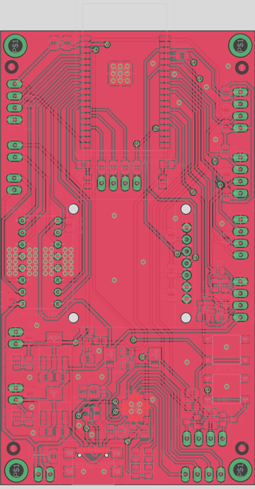
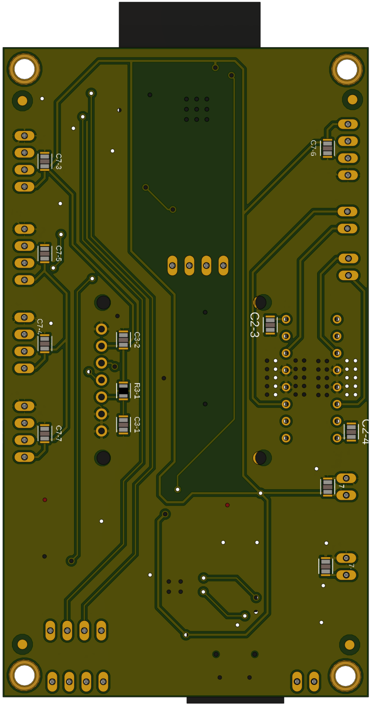
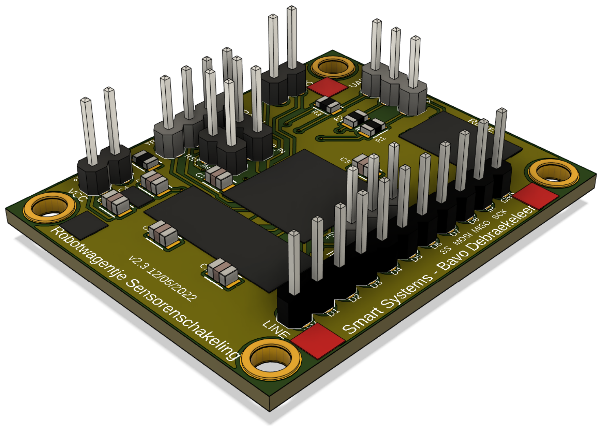

# Robotwagentje

 

 

 
 
 
 
 
 

Bavo Debraekeleer 
Docent: Marc Smets en Maarten Luyts 

Smart Systems, major Internet of Things, Elektronica-ICT 
AP Hogeschool 
Academiejaar 2021-2022

<a href="https://bavodebraekeleer.github.io/bavod-robotwagentje-analyse/#/">Robotwagentje Analyse GitHub Pages</a> 
<a href="https://ap-it-gh.github.io/ssys-cursus/#/deliverables/analyse">Smart Systems GitHub Pages</a> 

---

# Probleemstelling

Ontwerp van een schakelingen om een robotwagentje aan te sturen.
Dit opgedeeld in twee deel schakelingen.
Een hoofd PCB met een ESP32, als ook een dochter PCB met een ATMega en sensoren om de sturing te kunnen realiseren.
De vereisten zijn omschreven in de To-Be Situatie.

---

## As-Is Situatie

Grote PCB met enkel through hole componenten en screw terminals.

Eigenschappen:
 - Gebruik ESP32-WROOM-32 Dev. Kit
 - Voltage Regulator LM7805 through hole
 - Motord river SN754410 through hole + 2x 2 motor pins: 1A, 1B, 2A, 2B
 - 4x LED's: 1x rood, 2x geel, 1x groen
 - LCD scherm module, I²C pins op PCB: GND, SDA, SCL, 3V3
 - Ultrasoon module aansluiting: 5V, TRIG, ECHO, GND
 - 3 voeding pins: 3V3, 5V, GND
 - 2 pin aansluiting: 3V3, PQ_L
 - 2x 2 GPIO spare pins

---

## To-Be Situatie of Systeemspecificaties

### Opdracht doelen

 - Sensoren toepassen in een praktische schakeling.
 - Voldoende materiaal genereren voor gebruik in het eerste jaar.
 - Besturing voorzien.

### Sturingsschakeling vereisten:

Dit is de hoofd PCB.

 - ESP32-WROVER-B microcontroller module zelf integreren in PCB.
 - SMD componenten gebruiken.
 - 2x UART connectoren
 - 3x I²C connectoren
 - Voltage regulator LDL1117 SMD
	- 5V
	- 3.3V
 - Polariteitsbeveiliging
 - 2x SMD Motor driver
	- 7.2V
	- 700mA (Start stroom = 6x nominale stroom)
	- Prijs < €1
	- EMK beveiligingsdiode in tegen polariteit. Misschien reeds aanwezig op IC. Best altijd extra diode bij plaatsen voor de zekerheid.
 - OLED-scherm met I²C-sturing op PCB
 - Mounting drill holes, voor bevestiging op wagentje
 - Batterij aansluiting (GND, VCC)

### Sensorenschakeling vereisten:

Samen op één dochter PCB of opgedeeld in meerdere PCB bordjes.

 - ATMega328p
 - Ultrasoon + IR afstandssensoren
 - 8 channel IR Line tracker

### Besturing

 - Modus selectie
 - Manuele bediengingsmodus
 - Automatisch rijden (afstandsmetingen)
 - Volgens vast patroon rijden (lijn volgen)

Er moeten ook een aantal verkeer signalisaties ontwikkeld worden zoals verkeerslichten, slagbomen, enz. 
Deze moeten dienen om de software van het wagentje te kunnen testen.

---

## Mindmap

### Interactieve Mindmap
<iframe width="1000" height="1000" src="https://miro.com/app/embed/uXjVOER2lsE=/?pres=1&frameId=3458764521281290834" frameBorder="0" scrolling="no" allowFullScreen></iframe>

### Mindmap afbeelding
 
<a href="./pictures/diagrams/mindmap.jpg">Minddmpa afbeelding openen.</a> 

---

# Hardware Analyse

## Blokschema

### Interactief Blokschema
<iframe width="1000" height="1000" src="https://miro.com/app/embed/uXjVOEQMNko=/?pres=1&frameId=3458764523376607643" frameBorder="0" scrolling="no" allowFullScreen></iframe>

### Blokschema afbeelding
 
<a href="./pictures/diagrams/blokschema_v5.jpg">Blokschema afbeelding openen.</a> 

---

## Specificaties

Reference websites:
 - <a href="https://be.farnell.com/">Farnell</a> 
 - <a href="https://www.mouser.be/">Mouser</a> 
 - <a href="https://www.digikey.be/">Digi-Key</a> 
 - <a href="https://www.tinytronics.nl/shop/nl">TinyTronics</a> 
 - <a href="https://octopart.com/">Octopart</a> 
 - <a href="https://componentsearchengine.com/">Component Search Engine</a> 

### Hoofd PCB: Sturingsschakeling

#### Microcontroller

<table style="width: 100%">
<colgroup>
    <col span="1" style="width: 15%;">
    <col span="2" style="width: 30%;">
    <col span="3" style="width: 40%;">
	<col span="4" style="width: 25%;">
</colgroup>
<tr>
    <th>Naam</th>
    <th>Eigenschappen</th>
    <th>Argumentatie</th>
    <th>Data</th>
</tr>
<tr>
    <td>ESP32-WROVER</td>
    <td>
        <ul>
            	<li><b>ESP32 REV1 microcontroller</b></li>
		<li>Core: ESP32-D0WDQ6</li>
		<li>SPI flash: 4 MB, 32 Mbits, 3.3 V</li>
		<li>PSRAM: 64Mbits</li>
		<li>Crystal: 40 MHz</li>
            	<li>Vcc = 3.0 - 3.6 V</li>
            	<li>Ioperating = 80 mA</li>
		<li>Imin delivered by power supply = 500 mA</li>
		<li>Module interfaces: SD card, UART, SPI, SDIO, I2C, LED PWM, Motor PWM, I2S, IR, pulse counter, GPIO, capacitive touch sensor, ADC, DAC, TWAI.</li>
		<li>On-chip sensor: Hall sensor</li>
		<li>Operating temperature: -40°C ~ +85°C</li>
		<li><i>Eenheidsprijs: €5,50</i></li>
		<li><i>Lead time: onbekend (op voorraad)</i></li>
        </ul>
    </td>
	<td>
		ESP32 module die beschikbaar is in het labo.
	</td>
    <td>
		<a href="./datasheets/esp32-wrover_datasheet_en-1223875.pdf">Datasheet Module</a> 
		<a href="./datasheets/esp32_datasheet_en.pdf">Datasheet ESP32</a> 
		<a href="./datasheets/esp32_hardware_design_guidelines_en.pdf">Hardware Design Guidelines</a> 
		<a href="https://www.tinytronics.nl/shop/nl/communicatie-en-signalen/draadloos/wi-fi/modules/esp32-wrover-wifi-module-pcb-antenne-aansluiting">Winkel TinyTronics</a> 
	</td>
</tr>
<tr>
    <td>ESP32-WROOM-32</td>
    <td>
        <ul>
            	<li><b>ESP32 microcontroller</b></li>
		<li>Core: ESP32-D0WD</li>
		<li>SPI flash: 4 MB, 32 Mbits, 3.3 V</li>
		<li>Crystal: 40 MHz</li>
            	<li>Vcc = 3.0 - 3.6 V</li>
            	<li>Ioperating = 80 mA</li>
		<li>Imin delivered by power supply = 500 mA</li>
		<li>Module interfaces: SD card, UART, SPI, SDIO, I2C, LED PWM, Motor PWM, I2S, IR, pulse counter, GPIO, capacitive touch sensor, ADC, DAC, TWAI.</li>
		<li>On-chip sensor: Hall sensor</li>
		<li>Operating temperature: -40°C ~ +85°C</li>
		<li><i>Eenheidsprijs: €4,68</i></li>
		<li><i>Lead time: 10 weken (op voorraad)</i></li>
        </ul>
    </td>
	<td>
		Alternatieve versie van de ESP32 module.
	</td>
    <td>
		<a href="./datasheets/esp32_wroom_32d_esp32_wroom_32u_datasheet_en-1365844.pdf">Datasheet Module</a> 
		<a href="./datasheets/esp32_datasheet_en.pdf">Datasheet ESP32</a> 
		<a href="./datasheets/esp32_hardware_design_guidelines_en.pdf">Hardware Design Guidelines</a> 
		<a href="https://www.digikey.be/nl/products/detail/espressif-systems/ESP32-WROOM-32/8544298">Winkel Digi-Key</a> 
		<a href="https://www.elektor.nl/wemos-lolin-esp32-oled-display-module-for-arduino"Alternatieve kit met OLED</a> 
	</td>
</tr>
</table>

#### Sturing

<table style="width: 100%">
<colgroup>
    <col span="1" style="width: 15%;">
    <col span="2" style="width: 30%;">
    <col span="3" style="width: 40%;">
	<col span="4" style="width: 25%;">
</colgroup>
<tr>
    <th>Naam</th>
    <th>Eigenschappen</th>
    <th>Argumentatie</th>
    <th>Data</th>
</tr>
<tr>
    <td>SN754410NE</td>
    <td>
        <ul>
            	<li><b>Quadruple Half-H Driver</b></li>
		<li>Through-hole IC met 2 drivers</li>
		<li>Package: DIP</li>
            	<li>Vcc = -0.5 - +36 V</li>
		<li>VO = -3 - +3 V</li>
            	<li>IO = ±1 A</li>
		<li>Power dissipation PD = 2.078 W</li>
		<li>Minimized Power Dissipation</li>
		<li><i>Eenheidsprijs: 2,93 - 2,48€</i></li>
		<li><i>Lead time: 26 weken (op voorraad)</i></li>
        </ul>
    </td>
    <td>
	    	Motor driver through-hole als vervanging door laattijdige beschikbaarheid van de TC78H621FN.
	    	Deze is duurder, maar was reeds beschikbaar in het labo.
	    	Heeft ook een veel betere power dissipatie.
	    	
	</td>
    <td>
		<a href="./datasheets/sn754410.pdf">Datasheet</a> 
	    	<a href="https://www.ti.com/product/SN754410?utm_source=google&utm_medium=cpc&utm_campaign=asc-mdbu-null-prodfolderdynamic-cpc-pf-google-wwe&utm_content=prodfolddynamic&ds_k=DYNAMIC+SEARCH+ADS&DCM=yes&gclid=CjwKCAjwqauVBhBGEiwAXOepkR7X_TbQLSMPEBN6Gi4rnnN5Pa6-_hU9Kx01femBMrHHq_HA4ZuNsRoCKgEQAvD_BwE&gclsrc=aw.ds">Website fabrikant</a> 
		<a href="https://be.farnell.com/texas-instruments/sn754410ne/ic-peripheral-driver-half-h-1a/dp/3118977?ost=SN754410">Winkel Farnell</a> 
	</td>
</tr>
<tr>
    <td>TC78H621FNG</td>
    <td>
        <ul>
            	<li><b>Stepping motor drivers</b></li>
		<li>Full, Half step resolution / Phase inputs</li>
		<li>2-phase bipolar stepper + full bridge driver</li>
		<li>SMD IC met 2 drivers</li>
		<li>Package: P-TSSOP16-0505-0.65-001</li>
            	<li>Vcc = 2.8 - 14 V</li>
		<li>VOUT = 18 V</li>
            	<li>IOUT = 1.1 A</li>
		<li>Power dissipation PD = 0.78 W</li>
		<li><i>Eenheidsprijs: 1,66 - 0,82€</i></li>
		<li><i>Lead time: 26 weken (op voorraad)</i></li>
        </ul>
    </td>
    <td>
	    	Motor driver aangegeven door docent als te gebruiken IC en op voorraad in het labo.
	    	
	</td>
    <td>
		<a href="./datasheets/TC78H621FNG_TOSC-S-A0003869562-1.pdf">Datasheet</a> 
	    	<a href="https://toshiba.semicon-storage.com/ap-en/semiconductor/product/motor-driver-ics/stepping-motor-driver-ics/detail.TC78H621FNG.html">Website fabrikant</a> 
		<a href="https://www.digikey.com/en/products/detail/toshiba-semiconductor-and-storage/TC78H621FNG-EL/9351603">Winkel Digi-Key</a> 
	</td>
</tr>
<tr>
    <td>LA6583MC-AH</td>
    <td>
        <ul>
            	<li><b>Motor driver</b></li>
		<li>Single Phase Driver With Hall Sensor Method (no Speed Control)</li>
		<li>SMD IC</li>
		<li>Output Configuration: Half Bridge, 2 outputs</li>
            	<li>Vcc = 2.8 - 14 V</li>
		<li>Vcc max = 15 V</li>
		<li>Icc drive = 4 - 6 - 9 mA</li>
            	<li>IOUT max = 800 mA</li>
		<li><i>Eenheidsprijs: 0,526€</i></li>
		<li><i>Lead time: onbekend (op voorraad)</i></li>
        </ul>
    </td>
    <td>
	    	Alternatieve Motor Driver als eerste voorgesteld door docent.
		Deze Motor Driver heeft twee outputs en wordt gebruikt om één motor aan te sturen in twee richtingen.
		Voor twee motors zijn er dus twee nodig in de schakeling.
		Een enkele IC om de twee motors aan te sturen komt veel duurder uit of zijn niet op voorraad.
		<a href="https://www.mouser.be/ProductDetail/Toshiba/TB6612FNGC8EL?qs=rsevcuukUAy2UalRuv4E%2FQ%3D%3D">Alternatief: TB6612FNG</a> 
	</td>
    <td>
		<a href="./datasheets/LA6583MC-AH.pdf">Datasheet</a> 
		<a href="https://be.farnell.com/on-semiconductor/la6583mc-ah/mtr-drvr-sngl-phase-fan-motor/dp/2728202?st=LA6583MC-AH">Winkel</a> 
	</td>
</tr>
<tr>
    <td>Merkloos OLED 0.96" SPI</td>
    <td>
        <ul>
		<li><b>0.96" OLED Display 128x64</b></li>
		<li>Vcc = 3.3 - 5 V</li>
		<li>Icc = 9 - 15 mA</li>
		<li>Controller: SSD1315</li>
		<li>Comm protocol: SPI of I²C</li>
		<li>Connector: 7 PIN's</li>
		<li>Afmetingen: 27.8 x 27.3 x 4.3 mm</li>
		<li>Drill holes: 2 mm diameter, ~1 mm van de rand</li>
		<li><i>Eenheidsprijs: €4,60 - €7,00</i></li>
		<li><i>Lead time: onbekend (op voorraad)</i></li>
        </ul>
    </td>
    <td>
		Er wordt hier gekozen voor een module omdat losse OLED displays moeilijk vindbaar zijn en/of duurder uitkomen, en meer werk zijn.
		Deze merkloze verzie is op voorraad in het labo en kan werken op I²C mits kleine aanpassingen aan de PCB.
		I²C aansluitingen: D0 = SCL, D1 = SDA, DC & CS = GND, RST = Solderen
		Goedkoper alternatief: Seeed Studio Grove 104020208
		<a href="https://www.distrelec.biz/en/ssd1315-grove-96-128-64-monochrome-oled-display-seeed-studio-104020208/p/30164993?utm_source=octoX&utm_medium=cse&utm_campaign=octo-feed&ext_cid=ceoctaqzzen-na">Winkel Distrelec</a> 
		<a href="https://wiki.seeedstudio.com/Grove-OLED-Display-0.96-SSD1315/">Fabrikant product info</a> 
		Enkele alternatieven van TinyTronics met I²C PIN connectors in meerdere formaten:
		<a href="https://www.tinytronics.nl/shop/nl/displays/oled/0.96-inch-oled-display-128*64-pixels-wit-i2c">0.96" 128x64 SSD1306 voor €7,00</a> 
		<a href="https://www.tinytronics.nl/shop/nl/displays/oled/1.3-inch-oled-display-128*64-pixels-wit-i2c">1.3" 128x64 SSH1106 voor €8,00</a> 
		<a href="https://www.tinytronics.nl/shop/nl/displays/oled/1.5-inch-oled-display-128*128-pixels-wit-i2c">1.5" 128x128 SSD1327 voor €10,00</a> 
		 <a href="https://www.tinytronics.nl/shop/nl/kabels-en-connectoren/kabels-en-adapters/jst-compatible/wemos-i2c-kabel-sh1.0-4p-10cm">JST 4P kabel I²C</a> 
		<a href="https://www.tinytronics.nl/shop/nl/kabels-en-connectoren/connectoren/jst-compatible/jst-xh-krimpstekker-en-behuizing-set">JST-HX stekkers set</a> 
	</td>
    	<td>
		<a href="./datasheets/OEL_Display_Module_SJY-2864KSWPG01.pdf">OLED Module Datasheet</a> 
		<a href="https://www.tinytronics.nl/shop/nl/displays/oled/0.96-inch-oled-display-128*64-pixels-blauw">Winkel TinyTronics</a> 
		<a href="https://github.com/olikraus/u8g2">Bibliotheek: U8g2</a> 
	</td>
</tr>
</table>

#### Voeding

<table style="width: 100%">
<colgroup>
    <col span="1" style="width: 15%;">
    <col span="2" style="width: 30%;">
    <col span="3" style="width: 40%;">
	<col span="4" style="width: 25%;">
</colgroup>
<tr>
    <th>Naam</th>
    <th>Eigenschappen</th>
    <th>Argumentatie</th>
    <th>Data</th>
</tr>
<tr>
    <td>Conrad Energy LiPo accupack</td>
    <td>
        <ul>
            	<li><b>LiPo softcase accupack</b></li>
            	<li>Vnomonaal = 7.4 V</li>
            	<li>Inominaal =  1200 mAh</li>
		<li>Aantal cellen: 2</li>
		<li>Belastbaarheid: 20 C</li>
		<li>Aansluiting: XT60, XH-balancer</li>
		<li>Afmetingen: 112 x 35 x 19 mm</li>
		<li><i>Eenheidsprijs: €16,49</i></li>
		<li><i>Lead time: onbekend (op voorraad)</i></li>
        </ul>
    </td>
    <td>
		Zelfde batterij als in de As-Is situatie blijft behouden.
	</td>
    <td>
		<a href="./datasheets/accu.pdf">Datasheet</a>
		<a href="https://www.conrad.be/nl/p/conrad-energy-lipo-accupack-7-4-v-2400-mah-aantal-cellen-2-20-c-softcase-xt60-1344133.html?t=1&utm_source=google&utm_medium=surfaces&utm_term=1344133&utm_content=free-google-shopping-clicks&utm_campaign=shopping-feed&vat=true&gclid=CjwKCAjwxOCRBhA8EiwA0X8hi6Dpvaew0u-kTnIyrUmKE2RRHzkksSaw41QoJ36AmjOCY1n-dP7VnRoC240QAvD_BwE&gclsrc=aw.ds&tid=13894944235_122657379817_pla-301443522443_pla-1344133&WT.srch=1">Winkel Conrad</a> 
	</td>
</tr>
<tr>
    <td>LDL1117S50R</td>
    <td>
        <ul>
            	<li><b>Voltage Regulator 5 V</b></li>
		<li>Package: SOT223 SMD</li>
		<li>Voutput = 5 V</li>
            	<li>Vinput = 2.5 - 18 V</li>
            	<li>Ioutput = 1.2 A</li>
		<li><i>Eenheidsprijs: €0,56</i></li>
		<li><i>Lead time: 52 weken (lage voorraad)</i></li>
        </ul>
    </td>
    <td>
		Eenvoudige en goedkope LDO regulator.
		Alternatieven die 3.3 en 5 V in één package doen hebben een lage Ioutput.
		Alternatief voorbeeld:
		<a href="https://www.mouser.be/ProductDetail/Microchip-Technology-Micrel/MIC5211-LXYM6-TR?qs=U6T8BxXiZAWZW72McTiFRQ%3D%3D">MIC5211-LXYM6-TR</a>
    </td>
    <td>
		<a href="./datasheets/LDL1117_algemeen.pdf">Datasheet algemeen</a> 
		<a href="./datasheets/LDL1117_SOT223_specific.pdf">Datasheet SOT223</a> 
		<a href="https://www.mouser.be/ProductDetail/STMicroelectronics/LDL1117S50R?qs=AQlKX63v8RsuN9BQFiVf%2Fg%3D%3D">Winkel Mouser</a> 
		<a href="https://www.avnet.com/shop/us/products/stmicroelectronics/ldl1117s50r-3074457345642528941?CMP=EMA_Octopart_inventoryfeed_VSE">Winkel AVNET (op voorraad)</a>
	</td>
</tr>
</table>
<table style="width: 100%">
<colgroup>
    <col span="1" style="width: 15%;">
    <col span="2" style="width: 30%;">
    <col span="3" style="width: 40%;">
	<col span="4" style="width: 25%;">
</colgroup>
<tr>
    <td>LDL1117S33R</td>
    <td>
        <ul>
            	<li><b>Voltage Regulator</b></li>
		<li>Package: SOT-223 SMD</li>
		<li>Voutput = 5 V</li>
            	<li>Vinput = 2.5 - 18 V</li>
            	<li>Ioutput = 1.2 A</li>
		<li><i>Eenheidsprijs: €0,56</i></li>
		<li><i>Lead time: 52 weken (op voorraad)</i></li>
        </ul>
    </td>
    <td>
		Eenvoudige en goedkope LDO regulator.
		Alternatieven die 3.3 en 5 V in één package doen hebben een lage Ioutput.
	</td>
    <td>
		<a href="./datasheets/LDL1117_algemeen.pdf">Datasheet algemeen</a> 
		<a href="./datasheets/LDL1117_SOT223_specific.pdf">Datasheet SOT223</a> 
		<a href="https://www.mouser.be/ProductDetail/STMicroelectronics/LDL1117S33R?qs=AQlKX63v8Rt9Bf6AWSrbFg%3D%3D">Winkel Mouser</a> 
		<a href="https://uk.farnell.com/stmicroelectronics/ldl1117s33r/ldo-fixed-3-3v-1-2a-sot-223-3/dp/2729708?st=ldl1117s33r">Winkel Farnell</a> 
	</td>
</tr>
<tr>
    <td>DMG3414U</td>
    <td>
        <ul>
            	<li><b>Polariteitsbeveiliging N-channel MOSFET</b></li>
		<li>Package: SOT-23 SMD</li>
            	<li>Vds = 20 V</li>
            	<li>Id = 4.2 A</li>
		<li>Rds(on) = 0.019 ohm</li>
		<li>Vgs(th) = 500 mV</li>
		<li>Pd = 780 mW</li>
		<li><i>Eenheidsprijs: 0,72€</i></li>
		<li><i>Lead time: 52 weken (op voorraad)</i></li>
        </ul>
    </td>
    <td>
		Een N-channel MOSFET met lage Rds(on) op de negatieve voedingslijn geeft de beste batterij levensduur volgens onderzoek.
		De DMG3414U heeft een lage threshold spanning zodat deze ook geleid bij lage spanningen, en een Vds en Id die hoog genoeg zijn zodat de MOSFET niet stuk gaat in deze schakeling met 7.2 V batterij.
		<a href="./datasheets/Polariteitsbeveiliging_dt94-8.pdf">Polariteitsbeveiliging onderzoek</a> 
		<a href="http://www.irf.com/technical-info/designtp/dt94-8.pdf">Web download (bron)</a> 
		<a href="https://www.elektormagazine.nl/magazine/elektor-199907/39665>Uitleg.</a> 
		<a href="https://www.circuitsonline.net/forum/view/50988>Uitleg.</a> 
	</td>
    <td>
		<a href="./datasheets/DMG3414U_N-MOSFET.pdf">Datasheet</a> 
		<a href="https://nl.farnell.com/diodes-inc/dmg3414u/mosfet-n-ch-w-diode-20v-4-2a-sot23/dp/2061404?st=mosfet%20n%20smd">Winkel Farnell</a> 
	</td>
</tr>
<tr>
    <td>Mini USB type B connector</td>
    <td>
        <ul>
            	<li><b>SMD USB connector</b></li>
		<li>Package: SMD/SMT</li>
		<li>Vnom = 30 V</li>
		<li>Inom = 1 A</li>
            	<li>Number of contacts: 5</li>
            	<li>Isolatieweerstand: 100 MOhms</li>
		<li><i>Eenheidsprijs: ~€1,00</i></li>
		<li><i>Lead time: 32 weken (op voorraad)</i></li>
        </ul>
    </td>
    <td>
	    	Alternatieve USB-poort.
		Om het testen en programmeren eenvoudiger te maken wordt er gekozen om ook een Mini USB poort te voorzien.
		Deze kan 5V voeding voorzien en als aangesloten op een UART poort ook de microcontrollers programmeren zoals het is op de Arduino Nano.
		Hiervoor is er ook het volgende component nodig, een USB Interface IC met USB naar UART Bridge.
    </td>
    <td>
		<a href="./datasheets/molex_USB-Mini-B_SMDconnector.pdf">Datasheet</a> 
		<a href="https://eu.mouser.com/ProductDetail/Molex/67503-1020?qs=7zcQ9RRVJlhHWuXYKEhKMg%3D%3D">Winkel Mouser</a> 
	</td>
</tr>
<tr>
    <td>USB4085-GF-A</td>
    <td>
        <ul>
            	<li><b>USB-C USB2.0 connector</b></li>
		<li>Package: through hole</li>
		<li>Vrating = 20 V DC</li>
		<li>Irating VBUS = 3.00 A</li>
		<li>Irating GND = 4.25 A</li>
		<li>Irating VCONN = 1.25 A</li>
		<li>Irating other pins = 0.25 A</li>
		<li><i>Eenheidsprijs: €0,92 - 0,64</i></li>
		<li><i>Lead time: 16 weken (op voorraad)</i></li>
        </ul>
    </td>
    <td>
	    	Alternatieve USB-poort op voorraad in het labo, maar wel through-hole.
	    	Voordeel van future proofing met USB-C tegenover andere USB types.
    </td>
    <td>
		<a href="./datasheets/USB-C_2.0_USB4085-GF-A.pdf">Datasheet</a> 
		<a href="https://www.digikey.nl/nl/products/detail/gct/USB4085-GF-A/9859733">Winkel Digi-Key</a> 
	</td>
</tr>
<tr>
    <td>USB4110-GF-A</td>
    <td>
        <ul>
            	<li><b>USB-C USB2.0 SMD connector</b></li>
		<li>Klemtype: through hole</li>
		<li>Vrating = 20 V DC</li>
		<li>Irating VBUS = 3.00 A</li>
		<li>Irating GND = 4.25 A</li>
		<li>Irating VCONN = 1.25 A</li>
		<li>Irating other pins = 0.25 A</li>
		<li><i>Eenheidsprijs: €1,27 - 0,79</i></li>
		<li><i>Lead time: 16 weken (op voorraad)</i></li>
        </ul>
    </td>
    <td>
	    	Gebruikte USB-poort. SMD versie van de USB4085-GF-A en gemakkelijker met de hand soldeerbaar, maar iets duurder.
	    	Voordeel van future proofing met USB-C.
    </td>
    <td>
		<a href="./datasheets/USB4110-2888203.pdf">Datasheet</a> 
		<a href="https://www.mouser.be/ProductDetail/640-USB4110-GF-A">Winkel Mouser</a> 
	</td>
</tr>
<tr>
    <td>FTDI FT232RL-REEL</td>
    <td>
        <ul>
            	<li><b>USB Interface IC: USB naar UART Bridge</b></li>
		<li>Package: SSOP-28 SMD/SMT</li>
		<li>Vcc = 3.3 - 5.25 V</li>
		<li>Ioperationeel = 25 mA</li>
            	<li>Standaard: USB 2.0</li>
            	<li>Interfacetype: UART</li>
		<li><i>Eenheidsprijs: ~€3,00 - 4,00</i></li>
		<li><i>Lead time: onbekend (niet op voorraad)</i></li>
        </ul>
    </td>
    <td>
	    	Alternatief.
		Dit component is nodig om de USB poort te verbinden met de microcontroller.
		Verder zijn volgende componenten, naast weerstanden en condensatoren, vereist voor een correcte werking:
		<ul>
            		<li>Schottky Diode: <a href="https://octopart.com/ss1p3l-m3%2F84a-vishay-42865893?r=sp">SS1P3L</a> of <a href="https://octopart.com/mbr0520lt1g-onsemi-2933?r=sp">MBR0520LT1</a></li>
			<li>Fuse/zekering: <a href="https://octopart.com/mf-fsmf050x-2-bourns-10470804?r=sp">MFFSMF050</a></li>
			<li>Reset knop: <a href="https://eu.mouser.com/ProductDetail/CK/PTS636-SK50-SMTR-LFS?qs=vLWxofP3U2y5oRNZdHfrFw%3D%3D">PTS363</a> of <a href="https://eu.mouser.com/ProductDetail/Panasonic/EVQ-P2F02K?qs=WwqriLBepZsV0QucKJ89rg%3D%3D">EVQ-P2F02K</a>
        	</ul>
    </td>
    <td>
		<a href="./datasheets/DS_FT232R_USB-UART.pdf">Datasheet</a> 
		<a href="https://eu.mouser.com/ProductDetail/Molex/67503-1020?qs=7zcQ9RRVJlhHWuXYKEhKMg%3D%3D">Winkel Mouser</a> 
		<a href="https://uk.farnell.com/ftdi/ft232rl-reel/ic-usb-to-uart-smd-28ssop/dp/1146032?CMP=GRHB-OCTOPART#anchorTechnicalDOCS">Winkel Farnell</a> 
		<a href="https://www.digikey.be/en/products/detail/FT232RL-REEL/768-1007-6-ND/1836408?curr=usd&utm_campaign=buynow&utm_medium=aggregator&utm_source=octopart">Winkel Digi-Key</a> 
	</td>
</tr>
<tr>
    <td>CP2102N-A02-GQFN28R</td>
    <td>
        <ul>
            	<li><b>USB Interface IC: USB naar UART Bridge</b></li>
		<li>Package: QFN-28 SMD/SMT</li>
		<li>Vcc = 3.0 - 3.6 V</li>
		<li>Ioperationeel = 13.7 mA</li>
            	<li>Standaard: USB 2.0</li>
            	<li>Interfacetype: UART</li>
		<li><i>Eenheidsprijs: ~€2,00</i></li>
		<li><i>Lead time: 40 weken (niet op voorraad)</i></li>
        </ul>
    </td>
    <td>
		Gebruikte USB interface die op voorraad is in het labo en daarom gebruikt wordt.
    </td>
    <td>
		<a href="./datasheets/CP2102N-A02-GQFN28R.pdf">Datasheet</a> 
		<a href="https://eu.mouser.com/ProductDetail/Silicon-Labs/CP2102N-A02-GQFN28R?qs=u16ybLDytRag4qKvSH3fTw%3D%3D">Winkel Mouser</a> 
		<a href="https://www.digikey.com/en/products/detail/CP2102N-A02-GQFN28R/336-5890-1-ND/9863483?curr=usd&utm_campaign=buynow&utm_medium=aggregator&utm_source=octopart">Winkel Digi-Key</a> 
	</td>
</tr>
<tr>
    <td>TXU0204QPWRQ1 Level Shifter</td>
    <td>
        <ul>
            	<li><b>4 bit Fixed Direction Voltage Level Translator</b></li>
		<li>Package: TSSOP-14 SMD/SMT</li>
		<li>Vcc = 1.08 - 5.5 V</li>
		<li>Ioperationeel = 6 uA</li>
		<li>Signaalvertraging 96 ns</li>
            	<li>Aantal kanalen: 4 channel</li>
            	<li>Push-pull level shifting: UART, SPI, JTAG</li>
		<li>Uitgangstype: 3-State</li>
		<li>Datasnelheid: 200 Mb/s
		<li><i>Eenheidsprijs: ~€0,42 - 0,94</i></li>
		<li><i>Lead time: 9 weken (op voorraad)</i></li>
        </ul>
    </td>
    <td>
	    	Alternatief. Zelf met componenten level shifter gemaakt.
		Om de USB interface ook te kunnen gebruiken voor de ESP32, die logische niveaus heeft van 3.3 V ipv 5 V, is er een level shifter nodig.
		De UART verbinding kan ook gebruikt worden om met andere toestellen te communiceren met logische niveaus van 5 V.
	    	Uiteindelijk niet gebruikt. Door alternatieve USB interface die op 3.3 V TTL werkt is er maar één opttionele level shifter meer nodig en deze wordt opgebouwd zonder IC.
    </td>
    <td>
		<a href="./datasheets/Level_Shifter_TXU0204QPWRQ1.pdf">Datasheet</a> 
		<a href="https://eu.mouser.com/ProductDetail/Texas-Instruments/TXU0204QPWRQ1?qs=QNEnbhJQKvbo%252BW7%2Fo1U3Qg%3D%3D">Winkel Mouser</a>
	</td>
</tr>
</table>

---

### Dochter PCB: Sensorenschakeling

#### Microcontroller

<table style="width: 100%">
<colgroup>
    <col span="1" style="width: 15%;">
    <col span="2" style="width: 30%;">
    <col span="3" style="width: 40%;">
	<col span="4" style="width: 25%;">
</colgroup>
<tr>
    <th>Naam</th>
    <th>Eigenschappen</th>
    <th>Argumentatie</th>
    <th>Data</th>
</tr>
<tr>
    <td>ATMega328p-AN</td>
    <td>
        <ul>
            <li>SPI flash: 4 MB, 32 Mbits, 3.3 V</li>
            <li>Vcc = 5 V</li>
            <li>Vmax = 6 - 20 V</li>
	    <li>Iper I/O pin = 40 mA</li>
	    <li>I3V3 I/O pin = 50 mA</li>
	    <li><i>Eenheidsprijs: ~ €3,00</i></li>
	    <li><i>Lead time: 76 weken (niet op voorraad)</i></li>
        </ul>
    </td>
    <td>
		De sensoren moeten op een apart bordje komen zodat de line tracker dicht tegen de grond zit.
		Omdat hiervoor zeer veel verbindingen vereist zijn is het eenvoudiger om een extra microcontroller te voorzien.
		Op die manier is er maar één enkele I²C verbinding nodig tussen de twee bordjes.
		Er wordt hier gekozen om een ATMega328p te embedden in de PCB zodat een vergelijkbare schakeling aan de Arduino Nano wordt bekomen.
		Iets waarmee studenten reeds vertrouwd zijn en een goede oefening.
    </td>
    <td>
		<a href="./datasheets/ATMega328p.pdf">Datasheet ATMega328p</a> 
		<a href="./datasheets/Arduino_Nano.pdf">Datasheet Arduino Nano</a> 
		<a href="https://docs.arduino.cc/hardware/nano">Officiële documentatie Arduino Nano</a> 
		<a href="https://store.arduino.cc/products/arduino-nano">Winkel Arduino</a> 
		<a href="https://octopart.com/search?q=ATMega328p-a&currency=USD&specs=0">Winkels</a> 
	</td>
</tr>
<tr>
    <td>Crystal HC49SM-16-30-50-60-16-ATF</td>
    <td>
        <ul>
	    <li>Frequency nominal: 16 MHz</li>
            <li>Frequency stability: 50 ppm</li>
            <li>Load capacitance: 16 pF</li>
	    <li>Crystal case: SMD, 11.4 x 4.65 mm</li>
	    <li><i>Eenheidsprijs: €0,284</i></li>
	    <li><i>Lead time: onbekend (op voorraad)</i></li>
        </ul>
    </td>
    <td>SMD crystal voor de ATMega.</td>
    <td>
		<a href="./datasheets/Crystal_HC49SM_1667017.pdf">Datasheet</a> 
		<a href="https://be.farnell.com/multicomp/hc49sm-16-30-50-60-16-atf/crystal-hc-49-4hsmx-16-0mhz/dp/1667017RL">Winkel Farnell</a>
    </td>
</tr>
<tr>
    <td>PCF8574</td>
    <td>
	<ul>
		<li><b>Remote 8-bit I/O Expander I²C</b></li>
		<li>Vcc = 2.5 - 6 V</li>
		<li>Icc Operating = 40 - 100 μA</li>
		<li>Icc Standby = 2.5 - 10 μA</li>
		<li><i>Eenheidsprijs: €</i></li>
		<li><i>Lead time: </i></li>
        </ul>
    </td>
    <td>
		Als alternatief voor het werken met een extra microcontroller kan er ook gebruik gemaakt worden voor een I/O expander.
		Deze kan de D1-D8 outputs van de line tracker's IR sensors opvangen en via I²C doorsturen waardoor de de vereiste GPIO pins op de ESP32 herleid worden naar 3.
	</td>
    <td>
		<a href="./datasheet/PCF8574_IOExpander_TI.pdf">Datasheet TI</a> 
		<a href="./datasheet/PCF8574_IOExpander_NXP.pdf">Datasheet NXP</a> 
		<a href="https://www.mouser.be/ProductDetail/Texas-Instruments/PCF8574DGVR?qs=wgAEGBTxy7kn%2FU04Mebwcg%3D%3D">Winkel Mouser PCF8574DGVR</a> 
		<a href="https://be.farnell.com/nxp/pcf8574t-3-512/i-o-expander-8bit-remote-so-16/dp/1506644?st=pcf8574">Winkel Farnell PCF8574T/3,512</a> 
	</td>
</tr>
</table>

#### Sensoren

<table style="width: 100%">
<colgroup>
    <col span="1" style="width: 15%;">
    <col span="2" style="width: 30%;">
    <col span="3" style="width: 40%;">
	<col span="4" style="width: 25%;">
</colgroup>
<tr>
    <th>Naam</th>
    <th>Eigenschappen</th>
    <th>Argumentatie</th>
    <th>Data</th>
</tr>
<tr>
    <td>MJKDZ MIR-3.0Y</td>
    <td>
        <ul>
            	<li><b>8x IR Line Tracking Module</b></li>
            	<li>Vcc = 3 - 5 V</li>
            	<li>Imax = ? mA</li>
		<li>Bereik (max. bij 5V) = 40 mm</li>
		<li>Afmetingen LxB: 17 x 67 mm</li>
		<li><i>Eenheidsprijs: €6,00</i></li>
		<li><i>Lead time: onbekend (op voorraad)</i></li>
        </ul>
    </td>
    <td>
		Gegeven in de opgave.
		
		Alternatief met PIN uitleg: <a href="https://einstronic.com/product/hy-s301-8-channel-line-tracking-sensor-module/">HY-S301</a> 
	</td>
    <td>
		<a href="http://www.mjkdz.com/mjkdz/products/18365968.html">Fabrikant website</a> 
		<a href="https://www.tinytronics.nl/shop/nl/sensoren/optisch/infrarood/8x-ir-lijn-tracking-module-40mm-bereik">Winkel TinyTronics</a> 
	</td>
</tr>

<tr>
    <td>Sharp GP2Y0A21YK0F</td>
    <td>
        <ul>
		<li><b>IR-afstandssensor</b></li>
		<li>Vcc = 4.5 - 5.5 V</li>
		<li>Ityp = 30 mA</li>
		<li>Bereik: 50 - 800 mm</li>
		<li>Afmetingen: 29.5 x 13 x 13.5 mm</li>
		<li><i>Eenheidsprijs: €5,50 - 12,06</i></li>
		<li><i>Lead time: 16 weken (op voorraad)</i></li>
        </ul>
    </td>
    <td>
		Op voorraad in het labo.
		Mogelijke variaties in exacte type en de bijhorende output spanning.
	</td>
    <td>
		<a href="./datasheets/Sharp_GP2Y0A21YK0F.pdf">Datasheet</a> 
		<a href="https://www.tinytronics.nl/shop/nl/sensoren/afstand/sharp-optische-afstandsensor-gp2y0a21yk0f">Winkel TinyTronics</a> 
		<a href="https://be.farnell.com/sharp/gp2y0a21yk0f/sensor-distance-analogue/dp/1243869?ost=gp2y0a21yk0f">Winkel Farnell</a> 
		<a href="https://www.mouser.be/ProductDetail/Sharp-Microelectronics/GP2Y0A21YK0F?qs=5S%2F4hkdqNNcI0gpWLEuQ8w%3D%3D">Winkel Mouser</a> 
	</td>
</tr>
<tr>
    <td>HC-SR04</td>
    <td>
        <ul>
           	<li><b>Ultrasoon afstandssensor</b></li>
           	<li>Vcc = 5 V</li>
           	<li>Icc = <2 - 15 mA</li>
			<li>Bereik: 20 - 4500 mm</li>
			<li>Resolutie: 3 mm</li>
			<li>Sensor hoek: <15°</li>
			<li>Ultrasone freq.: 40 kHz</li>
			<li><i>Eenheidsprijs: €3,00 - 7,21</i></li>
			<li><i>Lead time: 16 weken (op voorraad)</i></li>
        </ul>
    </td>
    <td>
		Op voorraad in het labo.
		Wat variatie in technische gegevens tussen leveranciers. Goed nakijken of het 3 V of 5 V logica betreft.
	</td>
    <td>
		<a href="./datasheets/distance_measurement_ultrasound_hcsr04-2489278.pdf">Datasheet</a> 
		<a href="./datasheets/HC-SR04_Adafruit_Product_Overview_3942.pdf">Data and application notes.</a> 
		<a href="https://www.tinytronics.nl/shop/nl/sensoren/afstand/ultrasonische-sensor-hc-sr04">Winkel TinyTronics</a> 
		<a href="https://www.mouser.be/ProductDetail/Adafruit/3942?qs=byeeYqUIh0OD1hDPcrj%252BAQ%3D%3D">Winkel Mouser (Adafruit)</a> 
		<a href="https://www.mouser.be/ProductDetail/OSEPP-Electronics/HC-SR04?qs=wNBL%252BABd93PqZEhuhHkuOw%3D%3D">Winkel Mouser (SEPP)</a> 
		<a href="https://www.osepp.com/downloads/HCSR04_Library.zip">OSEPP Library</a> 
		<a href="https://create.arduino.cc/projecthub/abdularbi17/ultrasonic-sensor-hc-sr04-with-arduino-tutorial-327ff6">Arduino tutorial</a> 
	</td>
</tr>
</table>

---

## Elektrische Schema's en PCB's

### Sturingsschakeling

 
<a href="./pictures/pcb/Sturingsschakeling_schema_v5.0.fsch">Schematic File</a> 

<iframe src="https://mymsn8893.autodesk360.com/shares/public/SH35dfcQT936092f0e4315df622c6781a3b6?mode=embed" width="1024" height="768" allowfullscreen="true" webkitallowfullscreen="true" mozallowfullscreen="true"  frameborder="0"></iframe>

### Sensorenschakelingen

#### Sensorenschakeling

Combineerd alle sensoren op één PCB met twee lagen.

 
<a href="./pictures/pcb/Sensorenschakeling_schema_v2.3.fsch">Schematic File</a> 

<iframe src="https://mymsn8893.autodesk360.com/shares/public/SH35dfcQT936092f0e43f35af6e629bf74a2?mode=embed" width="1024" height="768" allowfullscreen="true" webkitallowfullscreen="true" mozallowfullscreen="true"  frameborder="0"></iframe>

#### Sensorschakeling - Afstandssensoren

Aparte PCB voor de twee afstandssensoren, zowel IR als Ultrasoon, op één enkele laag.
Voor in-house fabricatie.

 
<a href="./pictures/pcb/Sensorschakeling_Afstandssensoren_PCBv1.0.fsch">Schematic File</a> 

<iframe src="https://mymsn8893.autodesk360.com/shares/public/SH35dfcQT936092f0e4333ed0a33f964ff06?mode=embed" width="1024" height="768" allowfullscreen="true" webkitallowfullscreen="true" mozallowfullscreen="true"  frameborder="0"></iframe>

#### Sensorschakeling - Linetracker

Aparte PCB voor de linetracker module op één enkele laag.
Voor in-house fabricatie.

 
<a href="./pictures/pcb/Sensorschakeling_Linetracker_PCBv1.0.fsch">Schematic File</a> 

<iframe src="https://mymsn8893.autodesk360.com/shares/public/SH35dfcQT936092f0e4323b9fb0bed9636b4?mode=embed" width="1024" height="768" allowfullscreen="true" webkitallowfullscreen="true" mozallowfullscreen="true"  frameborder="0"></iframe>

---

# Software Analyse

## Data I/O

### Sturingsschakeling

<table style="width: 100%">
<colgroup>
    <col span="1" style="width: 20%;">
    <col span="2" style="width: 40%;">
    <col span="3" style="width: 40%;">
</colgroup>
<tr>
    <th>Blok</th>
    <th>Data In</th>
    <th>Data Out</th>
</tr>
<tr>
    <th>ESP32</th>
    <td>
		<li>Configuratie instellingen</li>
		<li>Motor aansturing <b>WiFi</b></li>
		<li>Sensordata <b>I²C</b></li>
	</td>
    <td>
		<li>Feedback data <b>I²C</b></li>
		<li>2x motor aansturing <b>PWM</b></li>
	</td>
</tr>
<tr>
    <td>Motor Driver</td>
    <td>Motor aansturing <b>PWM</b></td>
    <td>N.V.T.</td>
</tr>
<tr>
    <td>OLED Display</td>
    <td>Feedback data <b>I²C</b></td>
    <td>N.V.T.</td>
</tr>
</table>

### Sensorenschakeling Line Tracker

<table style="width: 100%">
<colgroup>
    <col span="1" style="width: 20%;">
    <col span="2" style="width: 40%;">
    <col span="3" style="width: 40%;">
</colgroup>
<tr>
    <th>Blok</th>
    <th>Data In</th>
    <th>Data Out</th>
</tr>
<tr>
    <th>ATMega328p</th>
    <td>
		<li>Configuratie instellingen</li>
		<li>Line Tracker data D1-D8</li>
	</td>
    <td>
		<li>Sensordata <b>I²C</b></li>
		<li>Line Tracker IR aan/uit</li>
	</td>
</tr>
<tr>
	<td>Line tracker</td>
    	<td>IR aan/uit</td>
    	<td>Data van 8x IR sensoren D1-D8.</td>
</table>

### Sensorenschakeling Afstandssensoren

<table style="width: 100%">
<colgroup>
    <col span="1" style="width: 20%;">
    <col span="2" style="width: 40%;">
    <col span="3" style="width: 40%;">
</colgroup>
<tr>
    <th>Blok</th>
    <th>Data In</th>
    <th>Data Out</th>
</tr>
<tr>
    <th>ATMega328p</th>
    <td>
		<li>Configuratie instellingen</li>
		<li>Ultrasoon sensor echo</li>
		<li>IR-afstandssensor afstand als analoge spanning.</li>
	</td>
    <td>
		<li>Sensordata <b>I²C</b></li>
		<li>Ultrasoon sensor trigger</li>
	</td>
</tr>
<tr>
    <td>Ultrasoon sensor</td>
    <td>Trigger</td>
    <td>Echo</td>
</tr>
<tr>
    <td>IR-afstandssensor</td>
    <td>N.V.T.</td>
    <td>Afstand als analoge spanning.</td>
</tr>
</table>

---

## Statediagrams & Flowcharts

<iframe width="1000" height="1000" src="https://miro.com/app/embed/uXjVOCBJkAk=/?pres=1&frameId=3458764527646663194" frameBorder="0" scrolling="no" allowFullScreen></iframe>

### Modus Menu
 
 
### Manuele bediening
 

### Automatisch rijden
 

### Volgens vast patroon rijden
 

---

# Release Plan

De planning wordt uitgevoerd in vijf sprints van telkens twee weken.
Elke sprint worden Epics toegewezen die verder zijn opgedeeld in Technical Stories.

## Epics

1. Analyse
2. PCB ontwerp
3. Software ontwikkeling
4. Hardware samenstelling
5. Software implementatie
6. Validatie

---

## Technical Stories

1. Analyse (10 Story Points)
	- <b>Analyse maken</b>
		- Narrative:
			Analyse van de sturingsschakeling volgens onderstaand criteria.
			
		- Acceptance Criteria:
			- Probleemstelling in 2 tot 5 lijnen
			- Mindmap
			- Hardware analyse
			- Hardware blokdiaram
			- Specificatie tabel
			- Argumentatie en alternatieven tabel
			- Software analyse
			- Data In -en Outputs
			- State diagram
			- Flowchart
			- Release plan
			 
		- Story Points (Estimate):
			10

2. PCB ontwerp (10 Story Points)
	- <b>Sturingsschakeling</b>
		- Narrative:
			Het ontwerpen van de hoofd PCB aan de hand van de analyse.
			
		- Acceptance Criteria:
			 - 2x UART connectoren
			 - 3x I²C connectoren
			 - Voltage regulator 5V & 3.3V
			 - Polariteitsbeveiliging
			 - 2x SMD Motor driver
			 - OLED-scherm met I²C-sturing op PCB
			 - Batterij aansluiting (GND, VCC)
			 - Drill holes voor bevestiging van de PCB op het wagentje.
			 - Voldoet aan de vereisten voor in-house fabricatie.
		 
		- Story Points (Estimate):
			5
			
	- <b>Sensorenschakeling</b>
		- Narrative:
			Het ontwerpen van twee dochter PCB's aan de hand van de analyse. 
			Eén voor de linetracker en één voor de afstandssensors. 
			Deze bevatten een microcontroller die programeerbaar is kan communiceren via I²C.
			
		- Acceptance Criteria:
			- Eén PCB die de data van de Ultrasoon en IR afstandssensoren kan verwerken.
			- Eén PCB die de data van de 8 channel IR Line tracker kan verwerken.
			- Microcontroller die de data kan verwerken en doorsturen via I²C.
			- Drill holes voor bevestiging van de PCB op het wagentje.
			- Voldoet aan de vereisten voor in-house fabricatie.
		 
		- Story Points (Estimate):
			3
			
	- <b>PCB en onderdelen bestellen</b>
		- Narrative:
			Na het ontwerpen moeten de PCB's ook inhouse gefabriceerd worden. 
			Verder moet er een Bill of Materials (BOM) gegenereerd worden. 
			Componenten moeten verzameld worden en de ontbrekende componenten moeten besteld worden.
			
		- Acceptance Criteria:
			- Elektrische schema's van beide PCB's
			- Board files met de PCB-designs
			- gerber-files van beide PCB's
			- Bill of Materials
			- PCB's fabriceren
			- Ontbrekende componenten bestellen.
		 
		- Story Points (Estimate):
			2

3. Software ontwikkeling (12 Story Points)
	- <b>Menu</b>
		- Narrative:
			De gebruiker moet de software modus kunnen bepalen via een menu met opties aangestuurd via Wifi of Bluetooth. 
			Dit menu wordt op het ingebouwde OLED-display weergegeven.
			
		- Acceptance Criteria:
			- Weergeven menu op OLED-display.
			- Modus instellen
			- WiFi en Bluetooth verbinding.
			- Verwerking van commando's volgens statediagram en flowhcart.
		 
		- Story Points (Estimate):
			3
			
	- <b>Manuele bediening</b>
		- Narrative:
			De gebruiker moet het robotwagentje manueel kunnen bedienen.
			De commando's worden via internet of Bluetooth verzonden en via WiFi of Bluetooth ontvangen door de ESP32-module. 
			Deze moet de commando's verwerken en de Motor Driver aansturen.
			
		- Acceptance Criteria:
			- Verwerking van commando's volgens statediagram en flowhcart.
			- Aansturen van de motors via de Motor Driver.
		 
		- Story Points (Estimate):
			3
			
	- <b>Automatisch rijden</b>
		- Narrative:
			Het robotwagentje moet automatisch kunnen rijden zonder ergens tegen te botsen.
			Dit gebeurt aan de hand van twee afstandssensors:
			- IR-afstandssensor voor nauwkeurige korte afstand.
			- Ultrasoon sensor voor grove lange afstand.
			
			Wanneer er een obstakel gedetecteerd wordt waarmee het wagentje dreigt te botsen moet het wagentje bijgestuurd worden. 
			Het zal blijven draaien, links of rechts, tot er een vrij pad gevonden wordt. 
			Waarna het wagentje terug rechtdoor kan rijden. 
			Aangezien de sensoren op het dochter PCB staan moet de sensor data gelezen en verwerkt worden met de Arduino Nano/ATMega328p. 
			Deze moet dan verzonden worden over I²C naar de ESP23.
			
		- Acceptance Criteria:
			- Modus instellen, van ESP32 naar Arduino sturen over I²C.
			- IR-afstandssensor data opvragen en afstand berekenen met Arduino.
			- Ultrasoon sensor data opvragen en afstand berekenen met Arduino.
			- Data verzonden tussen Arduino en ESP32 met I²C.
			- Obstakel detectie uitvoeren op ESP32.
			- Correcte aansturing van de motor via de Motor Drivers met de ESP32.
		 
		- Story Points (Estimate):
			3
			
	- <b>Volgens vast patroon rijden</b>
		- Narrative:
			Het robotwagentje moet een zwarte lijn kunnen volgen in een bepaald patroon. 
			Dit gebeurt aan de hand van een IR Line tracker. 
			Als het wagentje afwijkt van de lijn moet er bijgestuurd worden in de juiste richting. 
			Het moet ook instaat zijn om een hoek te detecteren en de correcte bocht te nemen. 
			Aangezien de sensoren op het dochter PCB staan moet de sensor data gelezen en verwerkt worden met de Arduino Nano/ATMega328p. 
			Deze moet dan verzonden worden over I²C naar de ESP23.
			
		- Acceptance Criteria:
			- Modus instellen, van ESP32 naar Arduino sturen over I²C.
			- Patroon in zwarte lijn met absorptie van circa 950 nm.
			- In en uitschakelen van de Line tracker met de Arduino.
			- Line tracker data lezen en verwerken met de Arduino.
			- Data verzonden tussen Arduino en ESP32 met I²C.
			- Correcte aansturing van de motor via de Motor Drivers met de ESP32.
		 
		- Story Points (Estimate):
			3

4. Hardware samenstelling (8 Story Points)
	- <b>3D Print onderdelen</b>
		- Narrative:
			Om het dochter PCB op het wagentje te bevestigen moet een nieuw voorkant ontworpen worden voor het wagentje. 
			Hierbij moet er rekening gehouden worden dat de sensors goed geplaatst worden. 
			Dit zal gebeuren door de studenten die de minor Maker volgen.
			
		- Acceptance Criteria:
			- Line tracker moet <40 mm van de grond hangen.
			- Geen obstructie voor beide afstandssensoren.
			- USB-poorten van ESP32 en Arduino goed bereikbaar.
		 
		- Story Points (Estimate):
			N/A (Enkel voor studenten van de minor Maker.)
		
	- <b>Hoofd PCB bestukken</b>
		- Narrative:
			Eens de PCB is toegekomen kunnen de componenten gesoldeerd worden. 
			De componenten moeten verzameld worden en volgens schema gesoldeerd.
			
		- Acceptance Criteria:
			- Controle PCB print
			- Juiste plaatsing componenten volgens schema.
			- Kwalitatief gesoldeerd.
			- Werkende schakeling bekomen.
		 
		- Story Points (Estimate):
			4
	
	- <b>Dochter PCB's bestukken</b>
		- Narrative:
			Eens de PCB is toegekomen kunnen de componenten gesoldeerd worden. 
			De componenten moeten verzameld worden en volgens schema gesoldeerd.
			
		- Acceptance Criteria:
			- Controle PCB print
			- Juiste plaatsing componenten volgens schema.
			- Kwalitatief gesoldeerd.
			- Werkende schakeling bekomen.
		 
		- Story Points (Estimate):
			2
			
	- <b>Robotwagentje samenstellen</b>
		- Narrative:
			Eens de PCB's en 3D prints klaar zijn kan het wagentje in elkaar gestoken worden.
			
		- Acceptance Criteria:
			- Correcte plaatsing van de componenten.
			- Onderdelen met elkaar verbonden waar nodig.
		 
		- Story Points (Estimate):
			2

5. Software implementatie (4 Story Points)
	- <b>Microcontrollers programmeren</b>
		- Narrative:
			Nu de hardware klaar is moet de software nog geprogrammeerd worden op de microcontrollers.
			
		- Acceptance Criteria:
			- Sturingsschakeling geprogrammeerd.
			- Sturingsschakeling geprogrammeerd.
		 
		- Story Points (Estimate):
			4

6. Validatie (6 Story Points)
 	- <b>Hardware testen</b>
 	 	- Narrative:
			Eens de PCB's bestukt zijn moeten deze getest worden op een correcte werking.
			
		- Acceptance Criteria:
			- Alle componenten krijgen de correcte stroomvoorziening en spanning.
			- Microcontrollers werken correct.
			- Inputs en outputs werken.
			- Programmeren van de microcontrollers lukt.
		 
		- Story Points (Estimate):
			2
			
 	- <b>Software testen</b>
 		- Narrative:
			Tijdens de software ontwikkeling worden er unit tests uitgevoerd op de verschillende onderdelen. 
			Als alle onderdelen volledig zijn wordt ook de werking samen getest.
			
		- Acceptance Criteria:
			- Sensordata wordt opgemeten.
			- Sensordata wodrt correct verwerkt.
			- Modus instelling werkt.
			- Modussen hebben een correcte werking.
		 
		- Story Points (Estimate):
			2
			
	- <b>Testen geheel</b>
		- Narrative:
			Eens het robotwagentje volledig in elkaar steekt en de software erop staat is het moment van de waarheid aangebroken en zal het moeten getest worden.
			
		- Acceptance Criteria:
			- Alle componenten krijgen de correcte stroomvoorziening en spanning.
			- Microcontrollers werken correct.
			- Sensordata wordt opgemeten.
			- Sensordata wodrt correct verwerkt.
			- Modus instelling werkt.
			- Modussen hebben een correcte werking.
		 
		- Story Points (Estimate):
			2

---

## Sprints

De sprint planning is opgedeeld in vijf sprints van elk twee weken.

1. Analyse & PCB ontwerp (20 Story Points)
2. <em>Afwezig door Internationaal Project: Zanzibar</em>
3. <em>Afwezig door Internationaal Project: Zanzibar</em>
4. Presentatie Analyse & Software ontwikkeling & Hardware samenstelling (20 Story Points)
5. Software implementatie & Validatie (10 Story Points)

<a href="https://www.ap.be/sites/default/files/reglementen/OT/2021-2022/Academische_kalender_21-22_OT.pdf">Academische kalender 2021-22</a> 

---
